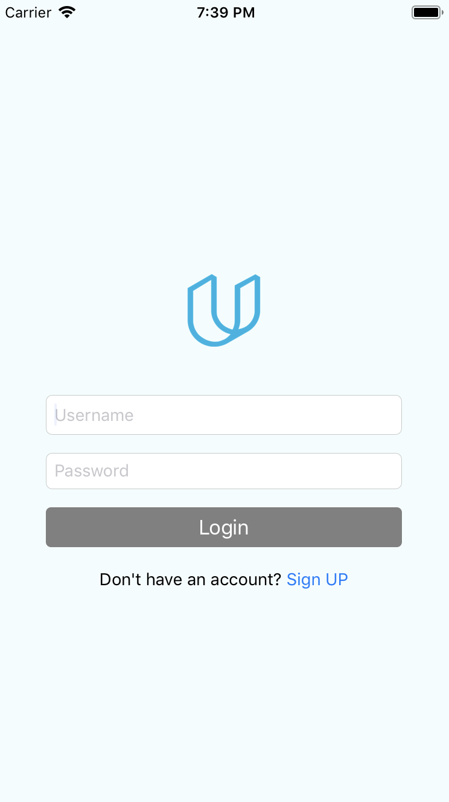

# OnTheMap
ios App that contains networks Api of Udacity. the user can login and view his\her fellow Udacity students around the world on the map. Udacity project

## How to run
* Download or clone repo 
* open OnTheMap.xcodeproj file
* run

## Api
* Udacity Api
* Pasre Api

## Screen Shots

